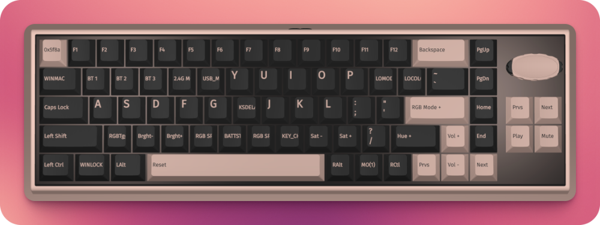

# [Iqunix Magi65](https://iqunix.com/products/magi65)

# Links

- [Iqunix Magi65](https://iqunix.com/products/magi65)
- [User Guide](https://iqunix.com/blogs/news/magi65)
- [VIA Guide](https://iqunix.com/blogs/news/magi-65-via-guide)
- [VIA Programming](https://usevia.app)

# Layouts

To restore layouts visit [VIA Programming](https://usevia.app) and use `Load Saved Layout`
with file `magi65.layout.json`

## Layout 0

## Layout 1

## Layout 2

# Specs

## Dimensions and Weight
| Specification | Details                                                                   |
| ------------- | ------------------------------------------------------------------------- |
| Model         | Magi65/Magi65 Pro                                                         |
| Layout        | 65% ANSI                                                                  |
| Type          | Mechanical Keyboard                                                       |
| Key Count     | 68                                                                        |
| Dimension     | 318mm * 108mm * 11mm (front height) / 357mm * 108mm * 11mm (front height) |
| Weight        | 900g/1030g                                                                |
| Warranty      | 1 Year                                                                    |

## Keycaps & Switches
| Component        | Specification                |
| ---------------- | ---------------------------- |
| Keycaps Material | PBT + Anti-Oil Coating       |
| Switch           | Gold Red Switch (Kailh 1353) |

## Function & Connection
| Feature            | Specification                               |
| ------------------ | ------------------------------------------- |
| Hot Swappable      | Support                                     |
| N-Key Rollover     | Support                                     |
| RGB Backlit        | 16-Million-Color Modules (with Per-Key RGB) |
| Interface          | USB Type-C                                  |
| Software           | VIA                                         |
| Mode               | Bluetooth 5.1 / 2.4GHz / USB-C              |
| Battery Capacity   | 3000mAh（3.7V）                             |
| Compatible Systems | Windows/ macOS / iOS / Android              |

## Case & Structure
| Component             | Specification                                                                                                                         |
| --------------------- | ------------------------------------------------------------------------------------------------------------------------------------- |
| Case Color            | Shadow Black / Ochre White                                                                                                            |
| Case Material         | CNC Aluminum Case                                                                                                                     |
| Craft                 | Anodized & E-coating                                                                                                                  |
| Structure             | Le-Tray                                                                                                                               |
| Larger Keys Style     | Plate-Mounted Stabilizer                                                                                                              |
| Silence Configuration | FR4 Gold-plated Plate, Horizontal Cut PCB, CR PCB Foam, IXPE Switch Pad, PET Switch Pad, Poron Bottom Case Foam, IXPE Bottom Case Pad |
