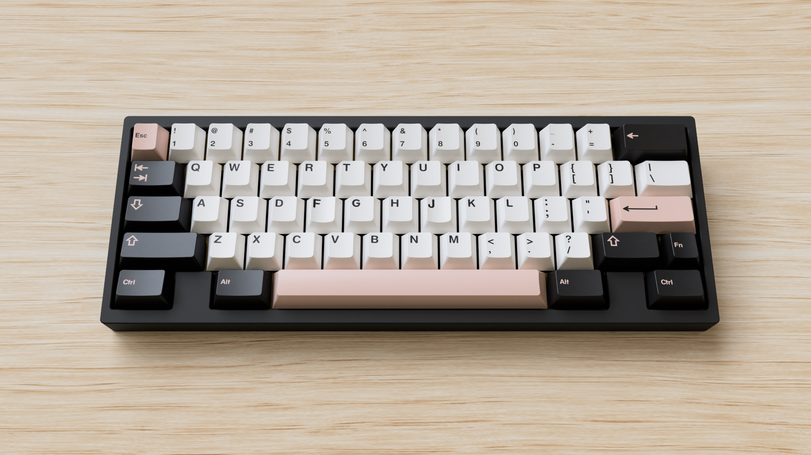
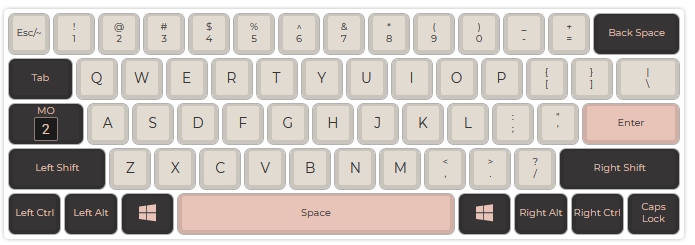
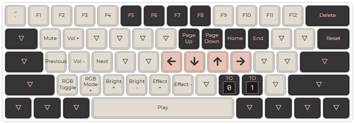
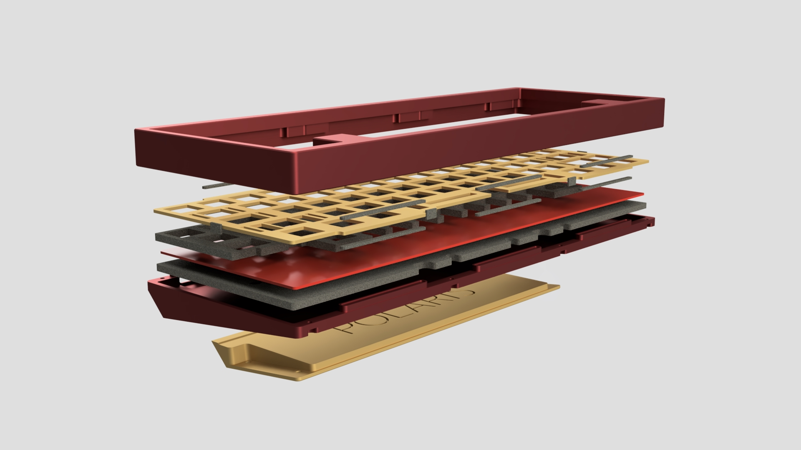

# [Polaris](https://kb.ai03.me/projects/polaris.html)

# Specs

- Case: ai03 Polaris Gasket Mounted PCB
- Switches: Holy Pandas
- Stablizers: Durock V2
- Keycaps: GMK Olivia
- Port: USB-C
- Microcontroller: amtmeg32u4

# Layout

## Layer 0

## Layer 1

## Layer 2

# Configuration

- [QMK Configurator](https://config.qmk.fm/#/ai03/polaris/LAYOUT_60_ansi)

# Flashing QMK

- [QMK Toolbox](https://github.com/qmk/qmk_toolbox)

1.  Put KB in flash mode `fn+\`
2.  Hit `Open` and select firmware `polaris.hex`
3.  Hit `flash`

# Links

- [ai03](https://kb.ai03.me/projects/polaris.html)
- Custom Layer Guide: https://jayliu50.github.io/qmk-cheatsheet/#layers
- Bootmagic Settings: https://beta.docs.qmk.fm/features/feature_bootmagic
- Keyboard Tester: https://www.keyboardtester.com/
