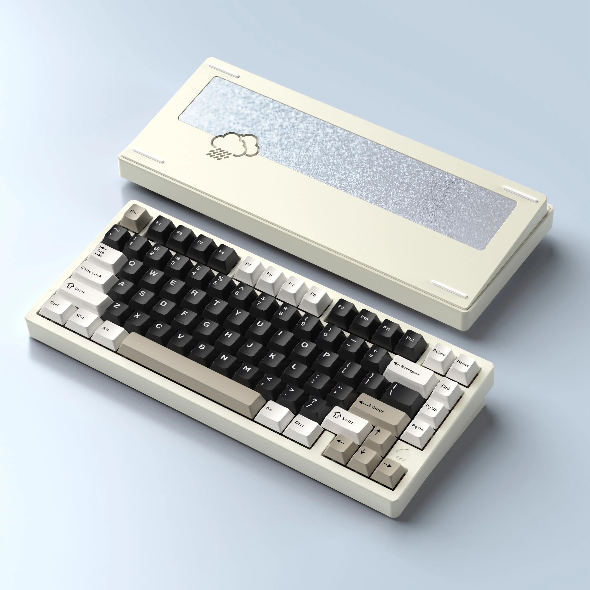
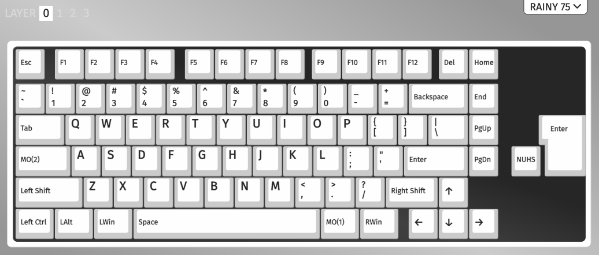
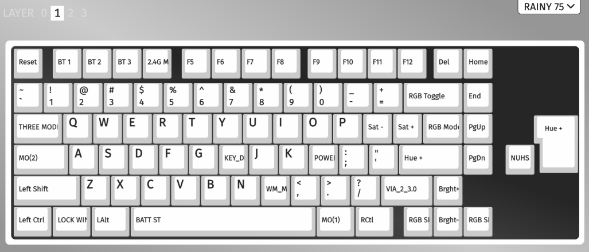
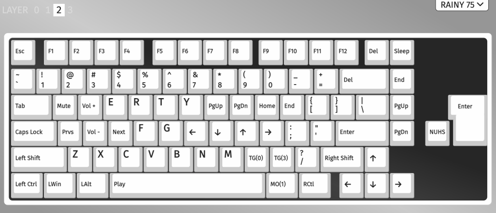
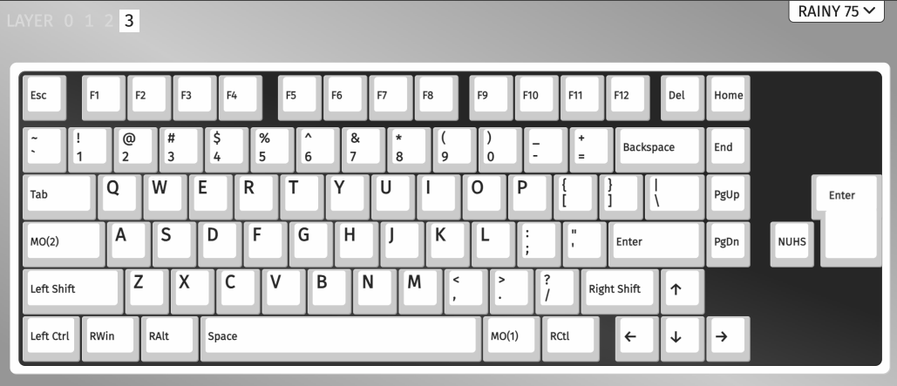
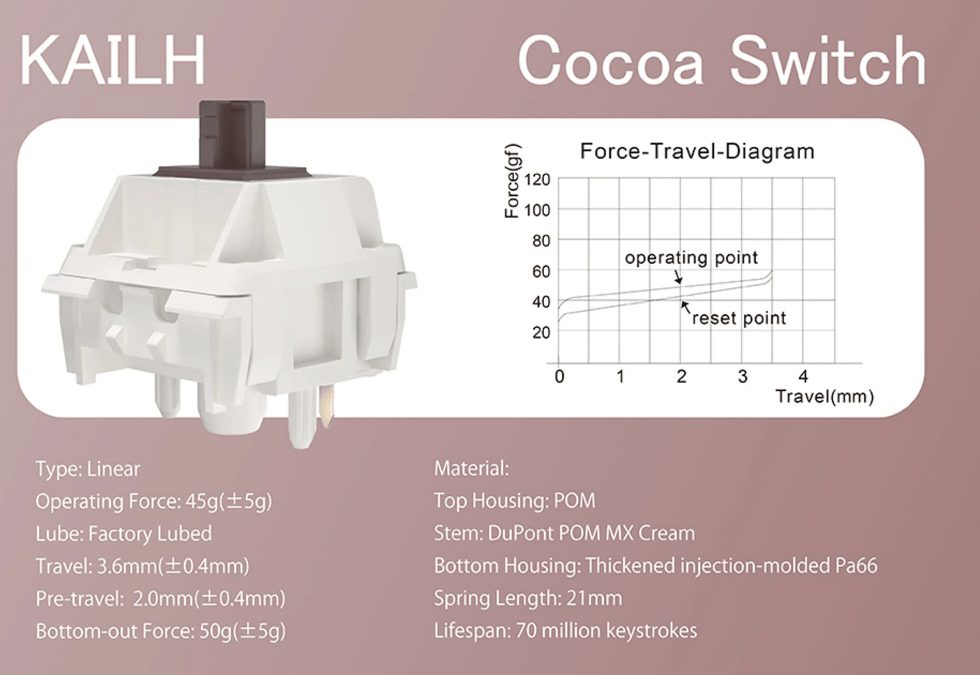
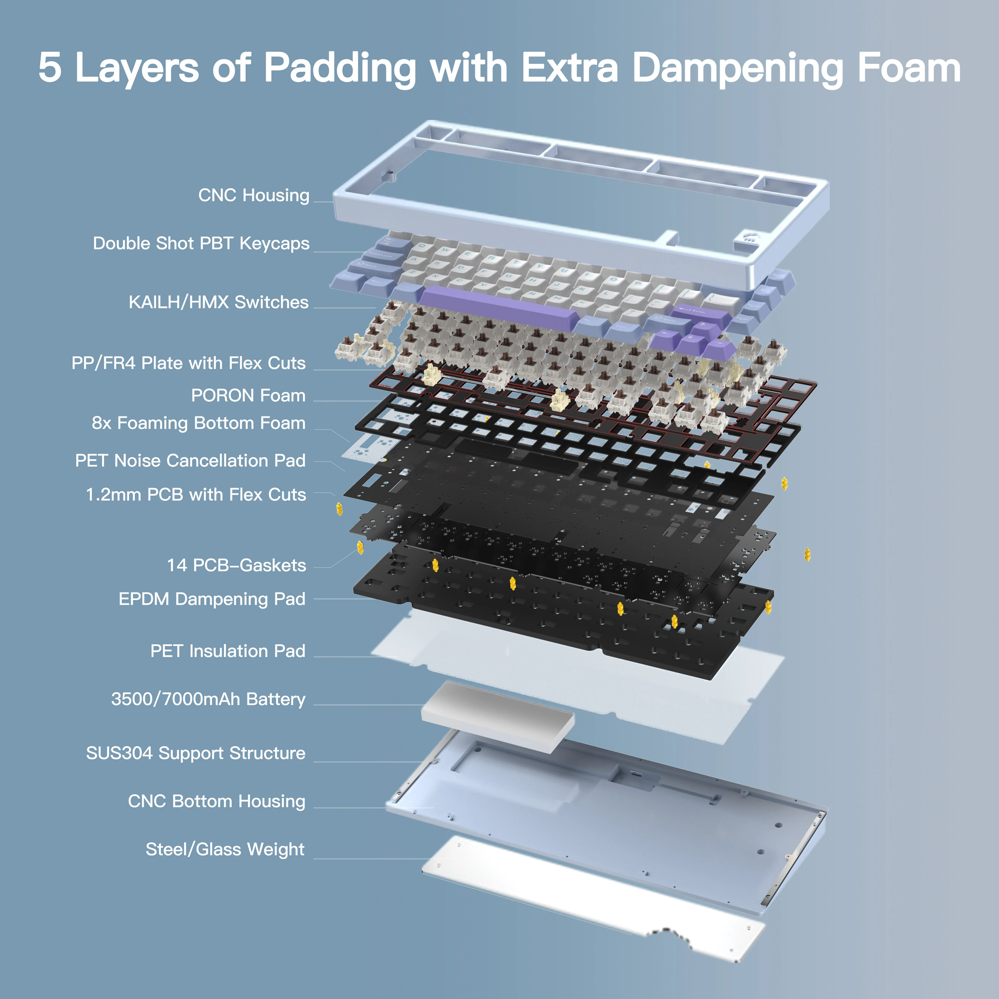

# [Wobkey Rainy75 Pro](https://www.wobkey.com/products/rainy75)

# Cheatsheet

`Caplocks` is momentary switch to layer 2 `M(2)` and `Fn` is momentary switch to layer 1 `M(1)`.

* `Capslock`+`<` to switch to the default layer (Layer 0).
* `Capslock`+`>` to switch to the windows layer (Layer 3).
* `Capslock`+`Fn` to switch to the factory layer (Layer 1).

## Wired / Wireless connections

* `Fn`+`TAB` - cycles through the different connection modes.

When `ESC` is blinking, it is in wired mode.

When `F4` is blinking, it is in 2.4GHZ mode.

The switch to enable the battery is under the `Capslock` key. Turn this on.

* `Fn`+`SPACE` to check battery level

### 2.4GHZ
* `Fn`+`TAB` to check connection status

# Links

- [Wobkey Rainy75](https://www.wobkey.com/products/rainy75)
- [Drop](https://drop.com/buy/wobkey-rainy75-mechanical-keyboard)
- [Rainy 75 User Manual](https://cdn.shopify.com/s/files/1/0835/9706/6540/files/Rainy_75_User_Manual.pdf?v=1734536757)
- [Support Page Chinese](http://www.woblab.cn/col.jsp?id=109)
- [VIA Programming](https://usevia.app)

# How to Program

Place KB into wired mode:

* Turn KB off using switch under `Capslock` key
* Use `Fn+Tab` to put KB in wired mode.  `Esc` key should be clinking

Visit [VIA Programming](https://usevia.app).  Load the default defintions
`default-layout-rgb-2.4g-rainy75-2.4g.json`

** This seems broken **
To restore custom defintion  use `Load Saved Layout`
with file `rainy75_custom_layout.json`

# Layouts

Custom Layouts

## Layout 0

This layout is the default layout to be used with Mac OSX.

Use `Capslock`+`<` to switch to the default layer.

## Layout 1

This layer is the factory layer for keyboard customization.  Refer to the [Rainy 75 User Manual](https://cdn.shopify.com/s/files/1/0835/9706/6540/files/Rainy_75_User_Manual.pdf?v=1734536757) for more information.

This is triggered by the `Fn` key to the right of the `Space` key.

## Layout 2

This is my typical layer 2 layout. The `Caps Lock` key is mapped to `Fn` key to access this layer.

## Layout 3

This is the windows layout.  The Windows key and Alt key are in the corret place for a windows machine.

Use `Capslock`+`>` to switch this layer.
Use `Capslock`+`<` to switch back to the default layer.

# Specs

## Dimensions and Weight
| Specification | Details                             |
| ------------- | ----------------------------------- |
| Model         | Wobkey Rainy75 Pro                  |
| Layout        | 75% ANSI                            |
| Type          | Mechanical Keyboard                 |
| Key Count     | 81                                  |
| Dimension     | 14.5" x 5.9" x 1"  (32 x 14 x 4 cm) |
| Weight        | 1.8 - 2kg                           |

## Keycaps & Switches

| Component        | Specification        |
| ---------------- | -------------------- |
| Keycaps Material | Doubleshot PBT       |
| Switch           | Kailh Cocoa Switches |
| Plate            | FR4                  |
| BackWeight       | Silver SUS304        |

## Function & Connection
| Feature            | Specification                               |
| ------------------ | ------------------------------------------- |
| Hot Swappable      | Support                                     |
| N-Key Rollover     | Support                                     |
| RGB Backlit        | 16-Million-Color Modules (with Per-Key RGB) |
| Interface          | USB Type-C                                  |
| Software           | VIA                                         |
| Mode               | Bluetooth 5.1 / 2.4GHz / USB-C              |
| Battery Capacity   | 7000mAh                                     |
| Compatible Systems | Windows/ macOS / iOS / Android              |

## Case & Structure

| Component     | Specification     |
| ------------- | ----------------- |
| Case Color    | Electro White     |
| Case Material | CNC Aluminum Case |
| Mounting      | Gasket            |
