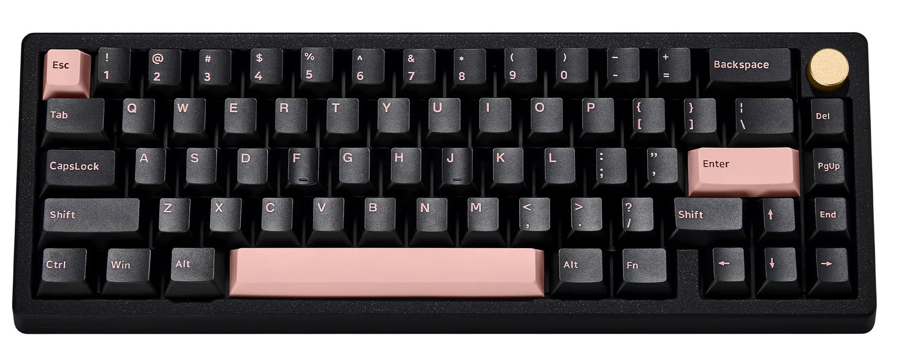
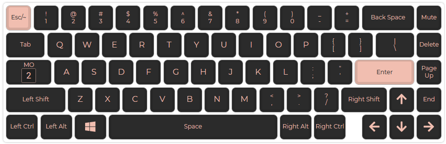
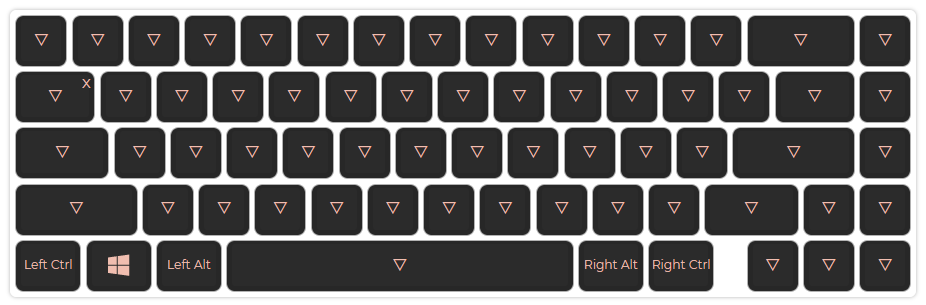
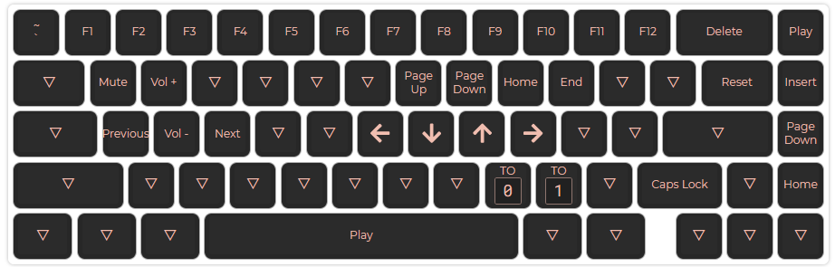

# [Zoom65](https://zoom65.com)



# Specs

- Case: Meletrix Zoom65 ($180)
- Plate: Acrylic
- Switches: Gateron Ink Black V2 ($84)
  - Linear: Actuation 60g Bottom 70g
  - NovelKey Deskeys Filmi
  - Switch Lube: Krytox 250g0
  - Spring Lube: 105 GPL
  - Stablizer Lube: Krytox 205g0
- Keycaps: GMK Olivia
- PCB: Gasket Mounted
- Port: USB-C
- Microcontroller: amtmeg32u4
- Firmwre: QMK

# Layout

## OSX Layer 0

- To switch to this layer use `Fn + <`



## Windows Layer 1

- To switch to this layer use `Fn + >`
- This just swaps the Windows and Alt key



## Function Layer 2



# Configuration

- [QMK Configurator](https://config.qmk.fm/#/meletrix/zoom65/LAYOUT_65_ansi_blocker)

# Flashing QMK

- [QMK Toolbox](https://github.com/qmk/qmk_toolbox)

1.  Put KB in DFU flash mode

- If using the custom layout use: `Fn + \`
- Default mode use `Fn + End`

2.  Hit `Open` and select firmware `zoom65.hex`
3.  Hit `flash`

# Custom Firmware

In order to get layer support for the encoder its required to custom build
a firmware.

1. Clone [QMK Firmware](https://github.com/qmk/qmk_firmware)
2. Get a working build envionrment
3. Update the code
4. Generate keymap from JSON. `qmk json2c zoom65-layout.json`
   and update deafult keymap
5. In the zoom65 folder run `qmk compile --keymap default`
6. Flash firmware

## Updates to make

`zoom65.c`

```c++
bool encoder_update_user(uint8_t index, bool clockwise) {
    // Layer 0
    if (get_highest_layer(layer_state|default_layer_state) == 0) {
        // First Encoder
        if (index == 0) {
            if (clockwise) {
                tap_code_delay(KC_VOLU, 10);
            } else {
                tap_code_delay(KC_VOLD, 10);
            }
        }
    } else {  /* Layer 1+ */
        // First Encoder
        if (index == 0) {
            if (clockwise) {
                tap_code_delay(KC_MNXT, 10);
            } else {
                tap_code_delay(KC_MPRV, 10);
            }
        }
    }
    return false;
}
```

`config.h`

```c++
// Add this line
// Flip encoder direction
#define ENCODER_DIRECTION_FLIP`
```

# Links

- [Zoom65](https://zoom65.com)
- [Meletrix Zoom65](https://meletrix.com/products/zoom65)
- [Custom Layer Guide](https://jayliu50.github.io/qmk-cheatsheet/#layers)
- [Bootmagic Settings](https://beta.docs.qmk.fm/features/feature_bootmagic)
- [Keyboard Tester](https://www.keyboardtester.com/)
